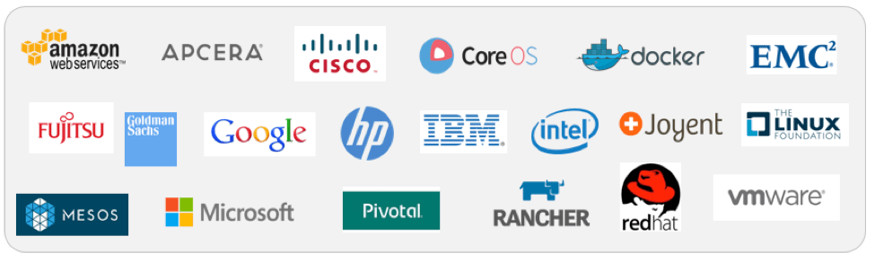
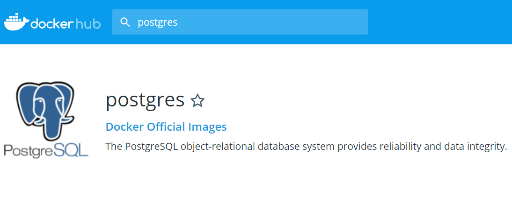

<link href="https://fonts.googleapis.com/css?family=Roboto+Condensed" rel="stylesheet" />
<style>
.reveal section img {
    border: 0px;
}
.reveal pre{
        box-shadow: 0px 0px 0px;
}
.reveal,
.reveal h1,
.reveal h2,
.reveal h3,
.reveal h4,
.reveal h5,
.reveal h6 {
  /*font-family: "Fira Sans";*/
  font-family: 'Roboto Condensed', sans-serif, Arial, Helvetica;
  color: black; 
}
.reduced{
    font-size:0.9em !important;
}
.exp{
    font-size:0.5em !important;
}
.hum{
    font-size:0.3em !important;
}
</style>

### Présentation docker 

#### CATI DIISCICO 
Julien Cufi
<small>04/02/2020</small>
<!-- .slide: class="center" -->
---
#### Présentation docker - CATI DIISCICO 
---------------------

1. Introduction et principes

2. Cas d'utilisation

3. Retours d'expérience


---
#### Introduction et principes
---------------------

*Qu'est-ce que c'est ?*

Docker est une technologie permettant d'exécuter une application dans un environnement isolé, comprenant l'application mais également l'ensemble des dépendances nécessaires a son fonctionnement.

---
#### Introduction et principes
---------------------
*Quelques mots de vocabulaire...*

* L'environnement dans lequel s'exécute l'application est appelé un ***conteneur Docker***.

* La matrice servant a définir ce qui est présent dans le conteneur est appelé une ***image Docker***.

* Un catalogue public d'images accessible sur le web permet de les mutualiser, ce catalogue s'appelle le ***DockerHub***.

---
#### Introduction et principes
---------------------
*Qui l'a crée et pourquoi ?*

* Docker est un projet OpenSource sous licence Apache 2.0 crée en 2013 par Solomon Hykes.

* Le projet est supporté par la communauté et par l'entreprise Docker Inc.

* Crée a l'origine pour la société dotCloud (PaaS)

---
#### Introduction et principes
---------------------


<small>Docker s'appuie sur une architecture client/serveur, un client en ligne de commande envoie des instructions (via une API REST) au serveur (daemon docker / docker engine).</small>

---
#### Introduction et principes
---------------------

*Comment ça marche ?*

A l'origine Docker s'appuie sur LXC (LinuX container) et les fonctionnalités d'isolation du noyau Linux (cgroup, namespaces, ...) pour fournir un environnement d'exécution étanche.

&rArr; Problème de portabilité pour Docker Inc.
<!-- .element: class="fragment" -->

<!--Parmis ces fonctionnalités citons les espaces de nom Linux (isolation du système de fichier, des processus, du  réseau), et les groupes de contrôle (limitation des ressources)-->


---
#### Introduction et principes
---------------------

* Remplacement de LXC par libcontainer
* Modularisation de la partie serveur
    * création d'outils spécifiques (creation container, gestion du cycle de vie...)
    * implémentation de référence des spécifications émise par Open Container Initiative...

---
#### Introduction et principes
---------------------

*Open Container Initiative* 

* Projet crée en 2015 et supporté par la Fondation Linux 
* Objectif : la normalisation des conteneurs 
    + environnement d'exécution des conteneurs
    + images 
* Crée par Docker Inc. avec quelques petites sociétés...

<!-- .element: class="reduced" -->


---
#### Introduction et principes
---------------------

*Je fais déjà ça avec mes machines virtuelles !*

Dans une machine virtuelle, on simule une machine (ie. toute la partie hardware) et chaque machine virtuelle a son propre système d'exploitation.
<!-- .element: class="reduced" -->


---
#### Introduction et principes
---------------------

*Comment je l'utilise ?*

* Docker est disponible sur Linux / Windows / Mac (VM)
    &rArr; requiert Hyperviseur sous windows
* Deux versions EE et CE (&ne; niveaux de support)
* On l'utilisera au travers de lignes de commandes

---

*passons à la pratique...* 

<iframe src="https://giphy.com/embed/JIX9t2j0ZTN9S" width="480" height="480" frameBorder="0" class="giphy-embed" allowFullScreen></iframe>
<!-- .slide: class="center" -->

---
#### Cas d'utilisation
---------------------

Deux cas d'utilisation 

* Pour l'admin sys qui souhaite tirer parti de Docker pour installer un logiciel et le tester

* Pour le développeur qui souhaite diffuser un logiciel

---
#### Cas d'utilisation
---------------------
*Quelques commandes de base*


```bash 
# Télécharger une image
$ docker image pull <image>

# Démarrer un conteneur
$ docker container run <image>

# Lister les conteneurs démarrés
$ docker container ps

# Stopper un conteneur
$ docker container stop <nom conteneur / identifiant>

# Supprimer un conteneur 
$ docker container rm <nom conteneur / identifiant>
```

<!-- .slide: class="reduced" -->

---
#### Docker : 1<sup class="exp">er</sup> cas d'utilisation
---------------------

>Je souhaite démarrer une base postgres v12 pour effectuer quelques tests.

* Recherche d'une image existante sur DockerHub
(https://hub.docker.com/)

* Le DockerHub contient 
    * des images officielles : vérifiées par Docker et à jour
    * des images non-officielles : le Far West

<!-- .slide: class="reduced" -->
<!--  -->

---
#### Docker : 1<sup class="exp">er</sup> cas d'utilisation
---------------------

Démarrage d'un conteneur basé sur l'image postgres:12

```bash 
$ docker container run -it postgres:12
Unable to find image 'postgres:12' locally
12: Pulling from library/postgres
8ec398bc0356: Downloading [====>]  11.72MB/27.09MB
65a7b8e7c8f7: Download complete
b7a5676ed96c: Download complete
```
Le client demande le démarrage d'un conteneur, le serveur ne connaissant pas l'image il interroge le DockerHub et la télécharge.

---
#### Docker : 1<sup class="exp">er</sup> cas d'utilisation
---------------------

Une fois l'image téléchargé le conteneur est démarré,
la base est prête a être utilisée

```bash 
PostgreSQL init process complete; ready for start up.
listening on IPv4 address "0.0.0.0", port 5432
database system is ready to accept connections
```

&rArr; Youpi ?
<!-- .element: class="fragment" -->

---
#### Docker : 1<sup class="exp">er</sup> cas d'utilisation
---------------------

*Quelques particularités sur les conteneurs*

* Environnement isolé de l'hôte donc *par défaut* :
    * Pas de communication réseau
    * Pas de partage de données
* Ephémères
    * Tant qu'ils ne sont pas supprimés les fichiers présents dans le conteneur sont persistés.

<!--Du point de vue de l'application, celle ci s'execute dans sa distribution Linux spécifique et avec son propre système de fichiers.-->

&rArr; Association de port hôte/conteneur
<!-- .element: class="fragment" -->

&rArr; Montage d'un volume partagé
<!-- .element: class="fragment" -->

---
#### Docker : 1<sup class="exp">er</sup> cas d'utilisation
---------------------

*On recommence*

```bash 
# Création d'un volume 
$docker volume create pgdata
pgdata
# Lancement du conteneur
$docker container run -it 
                      -p 5432:5432 
                      -v pgdata:/var/lib/postgresql/data postgres:12
```
-p 5432:5432 <br/>
&rArr; Association de port hôte/conteneur
<!-- .element: class="fragment" -->

-v pgdata:/var/lib/postgresql/data postgres:12<br/>
&rArr; Montage d'un volume partagé
<!-- .element: class="fragment" -->

<!-- .slide: class="reduced" -->

---
#### Docker : 1<sup class="exp">er</sup> cas d'utilisation
---------------------

*Pour les curieux*

```bash
$ docker volume inspect pgdata
[ 
    {
        "CreatedAt": "2019-02-26T17:12:59+01:00",
        "Driver": "local",
        "Labels": {},
        "Mountpoint": "/var/lib/docker/volumes/pgdata/_data",
        "Name": "pgdata",
        "Options": {},
        "Scope": "local"
    }
]
$ ls /var/lib/docker/volumes/pgdata/_data
postgresql.conf base     pg_commit_ts  pg_ident.conf  pg_notify
...
```
<!-- .slide: class="reduced" -->
---
#### Docker : 1<sup class="exp">er</sup> cas d'utilisation
---------------------

Slide sur docker-compose ?


---
#### Docker : 2<sup class="exp">eme</sup> cas d'utilisation
---------------------

>  J'ai implémenté un algorithme, je souhaite le mettre a disposition.

Objectif : 
Faciliter la reproductibilité des résultats en minimisant les étapes d'installation du logiciel

&rArr; Nécessite de créer une image Docker propre à son logiciel

<span class="hum">* mais il y en aura toujours </span>

<!-- .slide: class="reduced" -->

---
#### Docker : Création d'image 1/4
---------------------

* Une image docker est un fichier texte nommé Dockerfile respectant un language propre a Docker

* On peut "hériter" d'autres images existantes pour les étendre

* Il contient l'ensemble des instructions nécessaires a l'installation du logiciel

* Il est nécessaire de compiler le fichier Dockerfile pour l'utiliser

* L'image réalisée peut rester en local (sans être partagée sur le DockerHub)
<!-- .slide: class="reduced" -->

---
#### Docker : Création d'image 2/4
---------------------

Exemple de fichier Dockerfile :

```docker
FROM ubuntu:latest 
RUN apt-get update && \
    apt-get install -y cowsay
ENTRYPOINT ["/usr/games/cowsay"]
```

* FROM : Indique de quelle image existante l'on hérite
* RUN  : Permet de lancer des commandes d'installation
* ENTRYPOINT : Définit le point d'entrée du conteneur


---
#### Docker : Création d'image 3/4
---------------------
Compilation de l'image :

```bash
$ docker image build -t cow .
Step 1/3 : FROM ubuntu:latest                                 
 ---> dd6f76d9cc90                                            
Step 2/3 : RUN apt-get update &&     apt-get install -y cowsay
 ---> Running in 9a0c163a5579
...
Step 3/3 : ENTRYPOINT ["/usr/games/cowsay"]
 ---> Running in c17aa839e8a8
Removing intermediate container c17aa839e8a8
 ---> 000e5e657c8d
Successfully built 000e5e657c8d
Successfully tagged cow:latest
```
<!-- .slide: class="reduced" -->

---
#### Docker : Création d'image 4/4
---------------------

Utilisation de l'image
```bash
$ docker container run cow "Je suis une vache"
 ___________________                
< Je suis une vache >               
 -------------------                
        \   ^__^                    
         \  (oo)\_______            
            (__)\       )\/\        
                ||----w |           
                ||     ||           
```
<!-- .slide: class="reduced" -->

---
#### Docker : 2<sup class="exp">eme</sup> cas d'utilisation
---------------------

>  J'ai implémenté un algorithme, je souhaite le mettre a disposition.

Cette implémentation requiert :
* un jeu de données de test
* une version de java, de maven / ant

---
#### Docker : 2<sup class="exp">eme</sup> cas d'utilisation
---------------------

```docker
# Le fichier Dockerfile
FROM maven:3.6.2-jdk-8
RUN mkdir -p /app/results && \
    mkdir -p /app/src && \
    mkdir -p /app/data
COPY data /app/data
COPY src /app/src/
COPY pom.xml build.xml /app/
RUN gzip -d /app/data/FoodOnAgroPortalImport2.nq.gz && \
    chmod -R 755 /app
WORKDIR /app
CMD ["mvn", "package", "exec:java", ..."]
VOLUME [ "/app/results"]
```

```docker
# Installation du logiciel
$ docker image build -t align-tool .
# Lancement du logiciel sous linux
$ docker container run --rm -it -v ${pwd}/results:/app/results align-tool
# sous windows
$ docker container run --rm -it -v %cd%/results:/app/results align-tool
```
<!-- .slide: class="reduced" -->

---
#### Retour d'expérience
---------------------

Notre besoin :
* Mise en place de deux plateformes (test et production) avec nos applications
* Automatiser l'installation
    * applications web JAVA, Ruby, Python
    * base de données relationnelles, sémantiques, NoSQL
    * serveur de calcul R
* Mutualiser les installations
* Gérer "proprement" les différentes versions des dépendances (ex: JAVA)
<!-- .slide: class="reduced" -->

<!--8 applications web
ii. Schémas d'efactor, d'atweb, de spo2q, de meatylab, capex-ee, mychoice, de fuseki, de damn  = 4 BD sem (2 graphdb, 1 fuseki), 7 serveurs d'app (5 JAVA, 1 truc de capex, 1 ruby), 2 serveur R, 3 bases relationnelles (2 postgres, 1 mysql), 2 bases NoSQL = 9 BD, 7 Serv d'app, 2 serveurs R
~18 BD et serveurs X2 environnement de test et de prod oblige = 36 "composants"-->

---
#### Retour d'expérience
---------------------
* Complexité
    * Unix : lu, parlé, écrit
    * Problèmes liés au fait que docker soit monoprocessus
    * Impossibilité de charger des modules dans le kernel (modprobe)
    * Beaucoup de commandes ...
* Projet en constante évolution

---
#### Retour d'expérience
---------------------
* Bonnes pratiques (communes)
    * Bon sens : Ne pas récupérer aveuglement des images sur le DockerHub
    * Ne pas monter la racine / dans le conteneur
    * Groupe et utilisateur dédiés
    * Ne pas surcharger le conteneur avec des paquets inutiles
    * Logiciel a maintenir à jour

---
#### Retour d'expérience
---------------------

* Sécurité 
    * Nécessiterait une présentation dédiée!
    * Ne nous affranchit pas d'une configuration respectant les règles de sécurité en vigueur
    * Docker requiert des droits élevés : les conteneurs sont executés par root
    &rArr; Directive USER dans le DockerFile, configuration du serveur dockeremap
    &rArr; Benchmark de sécurité

---
#### Retour d'expérience
---------------------

---

Merci de votre attention !

Des questions ?

<!-- .slide: class="center" -->
---
#### Liens
---------------------

* Lien vers projet Docker OpenSource https://github.com/moby
* Documentation Docker https://docs.docker.com/
* Docker security bench https://github.com/docker/docker-bench-security
* Gif provenant de https://giphy.com/

<!-- .slide: class="reduced" -->