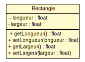
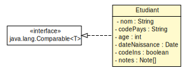
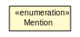
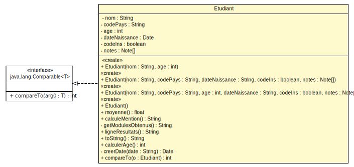
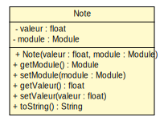

<style>
.reveal pre{
        box-shadow: 0px 0px 0px;
}
</style>

#### TD/TP 2 - Classes, attributs, et méthodes en UML et Java
---------------------------


---
#### Rappel de cours - Constructeur
---------------------

* Un constructeur est une opération particulière d’une classe qui permet de créer des instances de cette classe.

* En UML on précise qu'une opération est un constructeur au travers du stéréotype << create >>

 

<small>(diagramme partiel)</small>

---
#### Rappel de cours - Accesseur
---------------------

* Les accesseurs sont des méthodes qui permettent d’accéder aux attributs, en lecture et en écriture.
<div style="float:left;width:35%;height:100%;">
 
<p style="text-align:center;"><small >(diagramme partiel)</small></p>
</div>
<div style="float:right;width:65%">
<pre ><code style="overflow-y:hidden;height:100%;">
public class Rectangle {
    private float longueur;
    public float getLongueur() {
		return longueur;
	}
	public void setLongueur(float longueur) {
		this.longueur = longueur;
	}
    ...
}
</code></pre>
</div>

---

#### Diagrammes de classe
------------------






<small>(Sans opérations)</small>

</div>

---
#### Diagramme de la classe Etudiant
-------------------------

 

<small>(Sans Accesseurs)</small>
---

#### Diagramme de la classe Etudiant
-------------------------

 
<small>(Avec opérations et accesseurs)</small>

---

#### Diagramme des classes Module, Note
-------------------------

 


 

---
#### Question 3a

* Résultat par défaut de toString() sur un objet
```bash
java.lang.Object@6d6f6e28
```
* Résultat de toString() sur un objet Etudiant avec redéfinition
```bash
Nom étudiant :Jean
```

> Par défaut toString() retourne un hashcode, adresse de l’objet en mémoire

---
#### Question 3b

* Méthode toString() de la classe Etudiant

```java
public String toString() {
		return "Nom étudiant :" + this.getNom();
}
```
* Méthode toString() de la classe Module

```java
public String toString() {
    return "Nom module : " + this.getNom();
}
```

* Méthode toString() de la classe Note

```java
public String toString() {
    return "Note : " + getValeur() + " " + module.toString();
}
```
---
#### Question 4

* Méthode calculerAge de la classe Etudiant

```java
/**
* Calcule l'age de l'étudiant en se basant sur la date de naissance
* 
* @return l'age de l'étudiant
*/
public int calculerAge() {
 Long ageEnMillisecondes;
 Long ageEnAnnees;
 ageEnMillisecondes = new GregorianCalendar().getTimeInMillis();
 ageEnMillisecondes = ageEnMillisecondes - dateNaissance.getTime();
 ageEnAnnees = ageEnMillisecondes / (1000L * 60 * 60 * 24 * 365);
 return ageEnAnnees.intValue();
}
```