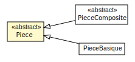
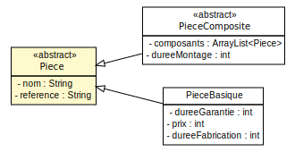
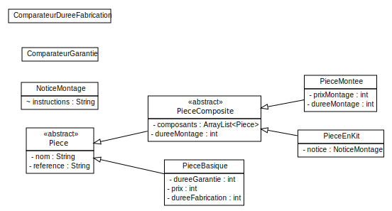
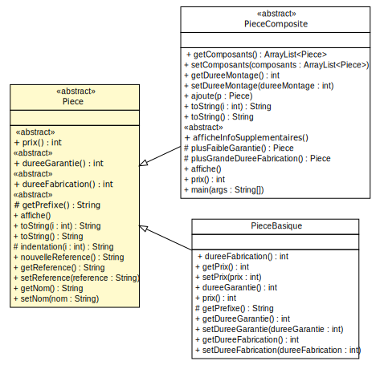
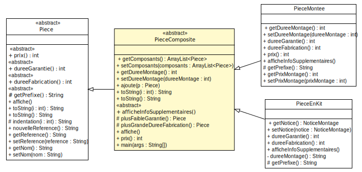
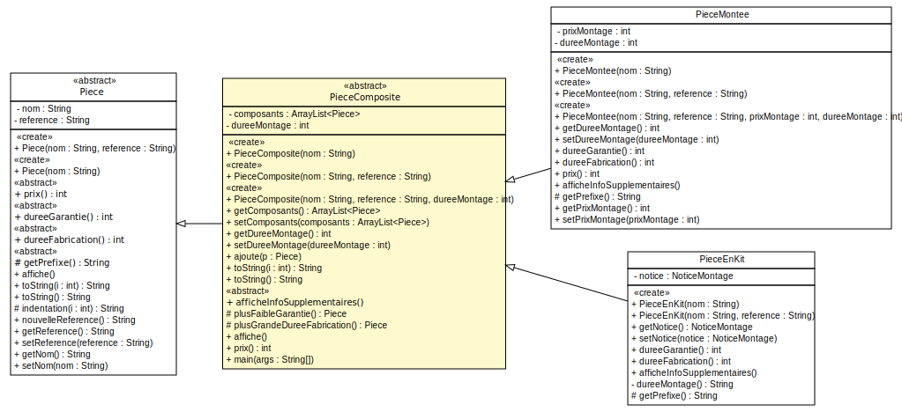

### TP9 - Etude de cas
----------------------

---
#### Modelisation UML

<small>Diagramme sans attributs/opérations/constructeurs</small>

---
#### Modelisation UML

<small>Diagramme sans opérations/constructeurs</small>

---
#### Modelisation UML

<small>Diagramme sans opérations/constructeurs</small>

---
#### Modelisation UML

<small>Diagramme sans attributs/constructeurs</small>

---
#### Modelisation UML

<small>Diagramme sans attributs/constructeurs</small>

---
#### Zoom

<small>Diagramme avec attributs/constructeurs/opérations</small>
