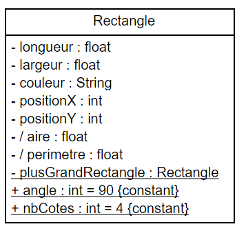

### TD/TP 1 Classes java basiques
---------------------------
 
 
 
 
 
 
 
 

&#x2709; julien.cufi@inra.fr

---
#### Rappel
---------------------

* Syntaxe UML d'un attribut dans un classe de la forme :
   
    [visibilité][/]nom[:type][[multiplicité]][= valeur ] <small>
    </small>
    * Visibilité ∈ {+, -, #, ~}
    * Multiplicité définit :
        * une valeur 1, n 
        ou 
        * une plage 1..2, 1..n
---
#### Exemples
-------------------------
* le nombre de cotés est de type int avec une visibilité privée et est constant
    <pre><code>+ nbCotes : int = 4 {constant} </pre></code>
* l'aire est un attribut dérivé de type float avec une visibilité publique
    <pre><code>- / aire : float</pre></code>
* le plus grand rectangle est un attribut de classe avec une visibilité protected
    <u style="color:white"><pre><code># plusGrandRectangle : Rectangle</pre></code></u>
---

#### Diagramme de classe et code JAVA
------------------
 

<small>(Sans opérations)</small>

<pre ><code style="overflow-y:hidden;height:100%;">
public class Rectangle {
    private float longueur;
    private float largeur;
    private String couleur;
    private int positionX;
    private int positionY;
    private static Rectangle 
            plusGrandRectangle;
    
    public final static int angle = 90;
    public final static int nbCotes = 4;}

</code></pre>

---

#### Diagramme d'instance et instanciation en JAVA
------------------
 

<pre ><code style="overflow-x:hidden;overflow-y:hidden;height:100%;">
public class Rectangle {
// Omission volontaire des attributs
public static void main(String[] args){
    Rectangle r;
    // Création d'une instance
    r = new Rectangle(5f, 5f, "Noir", 0, 0);
    System.out.println("Aire : "+r.aire());
}}
</code></pre>

---

#### Diagramme de classe et code JAVA Tortue
------------------

<small>(Sans opérations)</small>

<pre ><code style="overflow-y:hidden;height:100%;">
public class Rectangle {
    private float longueur;
    private float largeur;
    private String couleur;
    private int positionX;
    private int positionY;
    private static Rectangle 
            plusGrandRectangle;
    
    public final static int angle = 90;
    public final static int nbCotes = 4;}

</code></pre>

---
### Mise en pratique
---------------------------

---

#### Compilation / Execution d'un programme
------------------

1. Configuration du CLASSPATH (~/.bashrc)
    <pre><code>export CLASSPATH=${HOME}/Java:.</pre></code>
2. Prise en compte de la variable 
<pre><code>$ source ~/.bashrc</pre></code>
3. Compilation de l'exemple avec javac
<pre><code>$ javac SommeEtProduit.java</pre></code>
4. Execution du programme avec java
<pre><code>$ java SommeEtProduit</pre></code>
