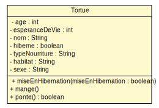

<style>
.reveal pre{
        box-shadow: 0px 0px 0px;
}
</style>

### TD/TP 1 Classes java basiques
---------------------------


---
#### Rappel
---------------------

* Syntaxe UML d'un attribut dans un classe de la forme :
   
    [visibilité][/]nom[:type][[multiplicité]][= valeur ] <small>
    </small>
    * Visibilité ∈ {+, -, #, ~}
    * Multiplicité définit :
        * une valeur 1, n 
        ou 
        * une plage 1..2, 1..n
---
#### Exemples
-------------------------
* le nombre de cotés est de type int avec une visibilité publique et est constant
    <pre><code>+ nbCotes : int = 4 {constant} </pre></code>
* l'aire est un attribut dérivé de type float avec une visibilité privée
    <pre><code>- / aire : float</pre></code>
* le plus grand rectangle est un attribut de classe avec une visibilité protected
    <u style="color:white"><pre><code># plusGrandRectangle : Rectangle</pre></code></u>
---

#### Diagramme de classe et code JAVA
------------------
<br/>
<div style="float:left;width:35%;height:100%;">

<small>(Sans opérations)</small>
</div>

</div>
<div style="float:right;width:65%">
<pre ><code style="overflow-y:hidden;height:100%;">
public class Rectangle {
    private float longueur;
    private float largeur;
    private String couleur;
    private int positionX;
    private int positionY;
    private static Rectangle 
            plusGrandRectangle;
    
    public final static int angle = 90;
    public final static int nbCotes = 4;}

</code></pre>
</div>

---

#### Diagramme d'instance et instanciation en JAVA
------------------
<br/>

 

```java
public class Rectangle {
// Omission volontaire des attributs
public static void main(String[] args){
    Rectangle r;
    // Création d'une instance
    r = new Rectangle(5f, 5f, "Noir", 0, 0);
    System.out.println("Aire : "+r.aire());
}}
```
---

#### Diagramme de classe de la Tortue
------------------



---

#### Code JAVA de la classe Tortue
------------------

```java
public class Tortue {
	private int age, esperanceDeVie;
	private String nom;
	private boolean hiberne;
	private String typeNourriture, habitat, sexe;
	private void miseEnHibernation(boolean miseEnHibernation) {
		this.hiberne = miseEnHibernation;
	}
	public void mange() {
		System.out.println("Mange..");
	}
	public boolean ponte() {
		return "F".equals(this.sexe);
	}}
```

---
### Mise en pratique
---------------------------

---

#### Compilation / Execution d'un programme
------------------

1. Configuration du CLASSPATH (~/.bashrc)
```bash
$ export CLASSPATH=${HOME}/Java:.
```
2. Prise en compte de la variable 
```bash
$ source ~/.bashrc
```
3. Compilation de l'exemple avec javac
```bash
$ javac <nom package>/SommeEtProduit.java
```
4. Execution du programme avec java
```bash
$ java <nom package>.SommeEtProduit
```

