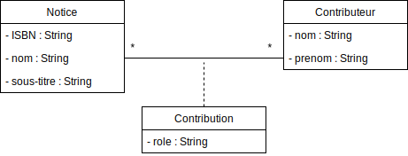
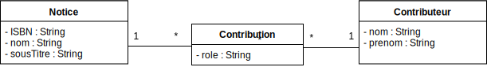
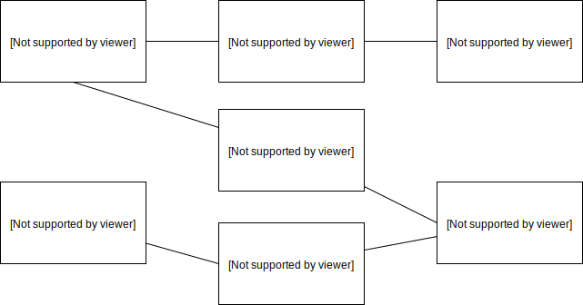
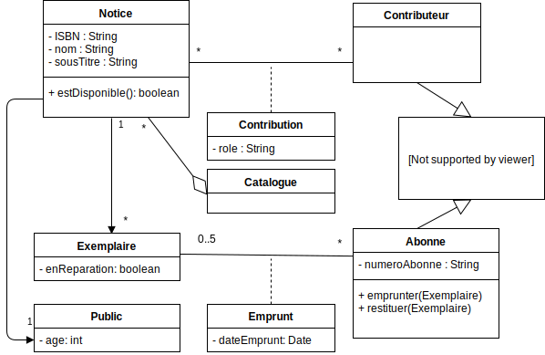
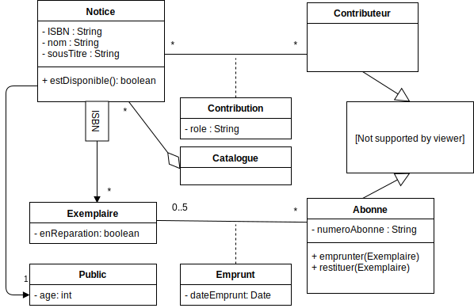

### TP6 - Bibliothèque
----------------------

---
#### Zoom sur la classe d'association

*Une même personne peut être contributrice dans plusieurs ouvrages, avec des roles différents*
---
#### Equivalence

---
#### Diagramme d'objets

<small>
*Daniel Pennac est auteur de "La fée Carabine" et rédacteur de la préface de "Une langue venue d'ailleurs" de Akira Mizubayashi.*</small>

---
#### Exemple de modélisation v1

---
#### Exemple de modélisation v2

<small>Avec association qualifiée</small>

---
#### Indexation des exemplaires par ISBN

    public class Notice {
        ...
        Hashmap< String, List<Exemplaire>> exemplaires;
        public Notice(){
            exemplaires = new Hashmap< String, List<Exemplaire>>();
        }
    }

