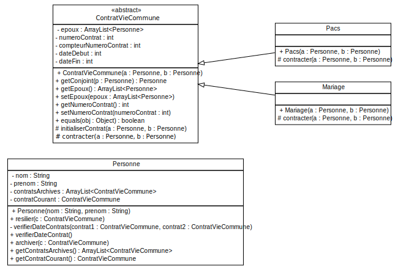

### TP7 - Relations maritales
----------------------

---
#### Modélisation UML

<small>(Diagramme partiel attributs/opérations manquantes)</small>

---
#### Zoom sur le constructeur

<pre  width="100%" height="100%"><code>
public class ContratVieCommune{
    private ArrayList<> epoux;
    private int numeroContrat;
    private static int compteurNumeroContrat = 0;
    public ContratVieCommune(Personne a, Personne b) {
        epoux = new ArrayList<>(2);
        // On incremente le compteur
        compteurNumeroContrat = compteurNumeroContrat + 1;
        // On affecte le numero de contrat
        numeroContrat = compteurNumeroContrat;
        contracter(a, b);
    }
}
</code></pre>
---
#### Méthode contracter de la classe Pacs ?
<pre><code>
public class Pacs extends ContratVieCommune {
	public Pacs(Personne a, Personne b) {
		super(a, b);
	}	
	
	protected void contracter(Personne a, Personne b) {
	// ?
	}

}
</code></pre>

---

#### Méthode "contracter" de la classe Pacs
<pre><code>
public class Pacs extends ContratVieCommune {
	...
    public Pacs(Personne a, Personne b) {
		super(a, b);
	}		
	protected void contracter(Personne a, Personne b) {
        // Si aucun contrat n'est en cours le PACS est contracté
		if (a.getContratCourant() == null && b.getContratCourant() == null) {
			initialiserContrat(a, b);
		} else {
			System.err.println(MessagesErreur.CONTRAT_EN_COURS);
		}
	}

}
</code></pre>

> Ou met-on la méthode initialiserContrat ?

---

#### Méthode "initialiserContrat"
<pre><code>
public class ContratVieCommune{
    ...
    protected void initialiserContrat(Personne a, Personne b){        
        GregorianCalendar calendar = new GregorianCalendar();
        int dateDebut = calendar.get(Calendar.YEAR);
        this.setDateDebut(dateDebut);        
        getEpoux().add(a);
        getEpoux().add(b);
        // On positionne l'instance de contrat en cours 
        // en tant que contrat courant pour a et b
        a.setContratCourant(this);
        b.setContratCourant(this);        
    }
}
</code></pre>
