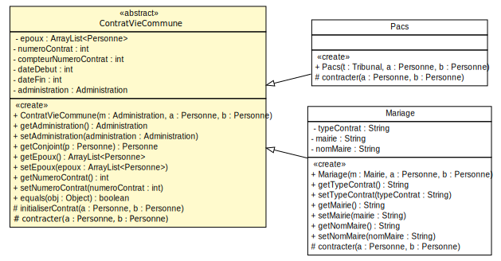
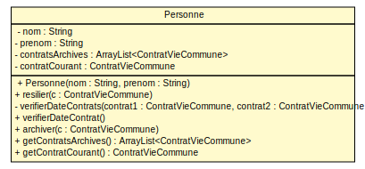
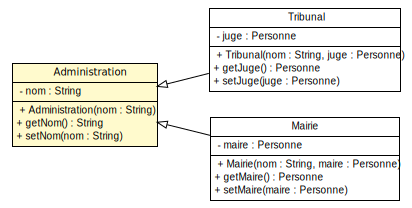

### TP7 - Relations maritales
----------------------


---
#### Modélisation UML


<small>(Diagramme partiel attributs/opérations manquantes)</small>

---

#### Modélisation UML


<small>(Diagramme partiel attributs/opérations manquantes)</small>

---

#### Modélisation UML


<small>(Diagramme partiel attributs/opérations manquantes)</small>

---

#### Méthode "résilier" de la classe Personne

<pre  width="100%" height="100%"><code>public class Personne {
    private ContratVieCommune contratCourant;
    private ArrayList< ContratVieCommune > contratsArchives; 
    public void resilier(ContratVieCommune c) {
        // Le contrat a résilier doit être le contrat courant
        Personne conjoint;
        ContratVieCommune contratConjoint;
        conjoint = contratCourant.getConjoint(this);
        contratConjoint = conjoint.getContratCourant();
        if(contratCourant.equals(c) && contratConjoint.equals(c)){
            this.archiver(c);
            conjoint.archiver(c);
        }
}
</code></pre>
<small> Extrait de code, ne contient pas l'ensemble des méthodes/attributs</small>

---
#### Méthode "getConjoint", classe ContratVieCommune

<pre  width="100%" height="100%"><code>public abstract class ContratVieCommune {
    private ArrayList< Personne > epoux;
    public Personne getConjoint(Personne p) {
        Personne conjoint;
        if (epoux.size() > 0) {
            if (p.equals(epoux.get(0))) {
                conjoint = epoux.get(1);
            } else { conjoint = epoux.get(0);}
        }else{
            conjoint = null;
        }
        return conjoint;
    }
}
</code></pre>
<small> Extrait de code, ne contient pas l'ensemble des méthodes/attributs</small>


---

#### Méthode "archiver" de la classe Personne

<pre  width="100%" height="100%"><code>public class Personne {
    private ContratVieCommune contratCourant;
    private ArrayList< ContratVieCommune > contratsArchives;
    public void archiver(ContratVieCommune c) {
        // On recupère l'année courante
        GregorianCalendar calendar = new GregorianCalendar();
        int dateFin = calendar.get(Calendar.YEAR);
        // On enregistre la date de fin dans le contrat
        c.setDateFin(dateFin);
        this.getContratsArchives().add(c);
        this.contratCourant = null;
    }
}
</code></pre>
<small> Extrait de code, ne contient pas l'ensemble des méthodes/attributs</small>

---
#### Zoom sur le constructeur

```java
public abstract class ContratVieCommune{
    private ArrayList< Personne > epoux;
    private int numeroContrat;
    private Administration administration;
    private static int compteurNumeroContrat = 0;
    public ContratVieCommune(Administration m,
                             Personne a, Personne b) {
        administration = m;
        epoux = new ArrayList< Personne >(2);
        // On incremente le compteur
        compteurNumeroContrat = compteurNumeroContrat + 1;
        // On affecte le numero de contrat
        numeroContrat = compteurNumeroContrat;
        contracter(a, b);
    }}
```
---

#### Méthode "contracter" de la classe Pacs

```java
public class Pacs extends ContratVieCommune {
    public Pacs(Tribunal t, Personne a, Personne b) {
		super(t, a, b);
	}		
	@Override
	protected void contracter(Personne a, Personne b) {
		if (a.getContratCourant() == null && 
            b.getContratCourant() == null) {
			initialiserContrat(a, b);
		} else {
			System.err.println(MessagesErreur.CONTRAT_EN_COURS);
		}

	}
```
<small> Extrait de code, ne contient pas l'ensemble des méthodes/attributs</small>


---

#### Méthode "contracter" de la classe Mariage

```java 
public class Mariage extends ContratVieCommune {
   protected void contracter(Personne a, Personne b) {
        if(a.estMariee() || b.estMariee()){
            System.err.println(MessagesErreur.DEJA_MARIEE);
            return;}
        if(a.estPacsee()){
            a.resilier(a.getContratCourant());}
        if(b.estPacsee()){
            b.resilier(b.getContratCourant());}
        initialiserContrat(a, b);
        }}}
}
```
<small> Extrait de code, ne contient pas l'ensemble des méthodes/attributs</small>
> Ou met-on la méthode initialiserContrat ?

---

#### Méthode "initialiserContrat"
```java
public class ContratVieCommune{
    protected void initialiserContrat(Personne a, Personne b){        
        GregorianCalendar calendar = new GregorianCalendar();
        int dateDebut = calendar.get(Calendar.YEAR);
        this.setDateDebut(dateDebut);        
        getEpoux().add(a);
        getEpoux().add(b);
        // On positionne l'instance de contrat en cours 
        // en tant que contrat courant pour a et b
        a.setContratCourant(this);
        b.setContratCourant(this);        
    }
}
```
<small> Extrait de code, ne contient pas l'ensemble des méthodes/attributs</small>


