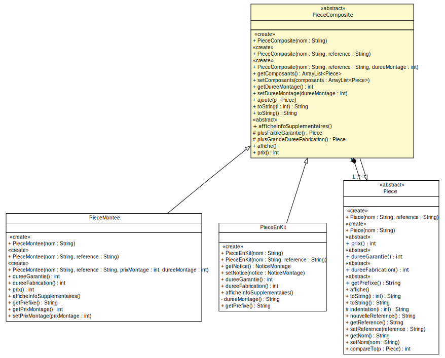

### TP9 - Etude de cas
----------------------

---
#### Modelisation UML

 
<small>Diagramme sans opérations/constructeurs</small>

---
#### Modelisation UML

<small>Diagramme sans opérations/constructeurs</small>

---
#### Modelisation UML

<small>Extrait de diagramme, focus sur les opérations d'intérêt</small>

---
#### Modelisation UML

<embed src="other/PieceMontee.svg" style="margin:0px;" width="100%" height="100%" />
<small>Diagramme sans attributs/constructeurs</small>

---
#### Modelisation UML

<small>Diagramme sans attributs/constructeurs</small>

---
#### Zoom

<small>Diagramme avec attributs/constructeurs/opérations, Alt & Clic droit pour le zoom ;)</small>